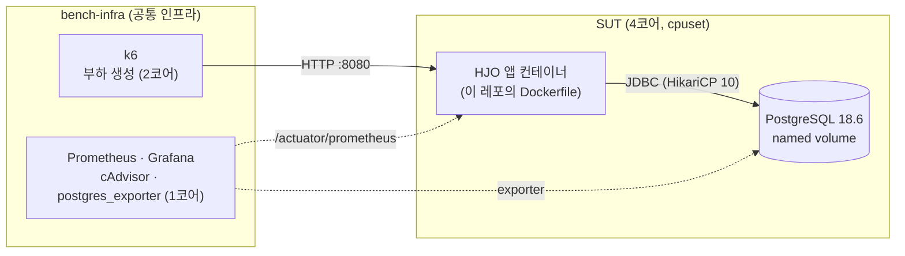
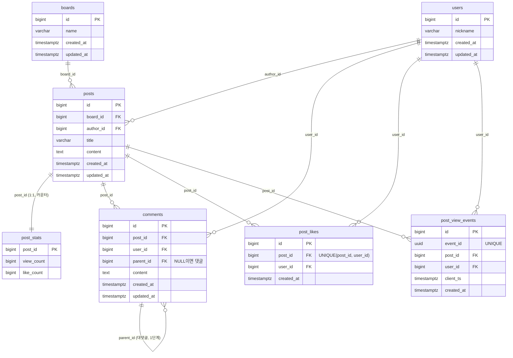

# HJO — 서버 고도화 스터디 baseline 실험대

3인 서버 고도화 스터디(15주)의 **공통 출발점**인 익명 게시판 API입니다.
이 위에 Throughput → Volume → Concurrency 문제를 차례로 얹고, 각자 개선한 설계를 **같은 조건에서 측정해 baseline 대비 배율로 비교**합니다.

> 이 코드는 좋은 설계가 아니라 **비교의 기준점**입니다. 캐시, 배치, 비동기, 큐, 조회 인덱스 없이 **일부러 순진하게** 만들었습니다.
> 성능 개선은 이 README의 [개선 아이디어](#개선-아이디어)에만 적고 코드에는 넣지 않습니다.

## 목차
- [기술 스택](#기술-스택)
- [전체 구조](#전체-구조)
- [실행 방법](#실행-방법)
- [환경변수](#환경변수)
- [앱 계약 (공통 인프라 연동)](#앱-계약-공통-인프라-연동)
- [인증과 토큰 형식](#인증과-토큰-형식)
- [API 명세](#api-명세)
- [에러 응답](#에러-응답)
- [시드 데이터 연동](#시드-데이터-연동)
- [테스트](#테스트)
- [개선 아이디어](#개선-아이디어)

---

## 기술 스택

| 항목 | 버전 | 비고 |
|---|---|---|
| JDK | **Eclipse Temurin 25** | 로컬 25.0.4.1, 컨테이너 이미지 `25.0.4_7`(Docker Hub에 25.0.4.1 이미지가 없어 패치 버전이 다름). `build.gradle` toolchain에서 벤더(ADOPTIUM)까지 고정 |
| Spring Boot | 3.5.16 | Spring MVC (WebFlux 없음). 가상 스레드는 설정으로 on/off, 기본 off |
| Gradle | 9.7.1 | JDK 25에서 데몬을 돌리려면 9.x가 필요 |
| PostgreSQL | 18.6 (`postgres:18.6-bookworm`) | 테스트(Testcontainers)와 운영이 같은 이미지 태그 |
| Flyway | 11.7.2 (Boot 관리) | PG 18에 "미검증 버전" 경고가 나오지만 동작은 정상 |
| 인증 | OAuth2 Resource Server (JWT 검증 전용) | HS256 |
| 모니터링 | Actuator + Micrometer Prometheus | `/actuator/prometheus` |
| 테스트 | JUnit 5, Mockito, Testcontainers, RestAssured 5.5.7 | |

---

## 전체 구조

### 실행 구성
이 레포는 **앱만** 가집니다. compose(SUT·k6·모니터링), 리소스 제한(cpuset), PostgreSQL 설정, 모니터링 스택, 측정 스크립트는 공통 인프라 레포(`bench-infra`)에 있습니다.



### 코드 구조 (계층형)
도메인별이 아니라 **역할(계층)별**로 나눕니다.

```
com.example.HJO
├─ controller/   요청과 응답. 요청 DTO 검증(@Valid)
│                PostController, CommentController, ViewController, LikeController
├─ service/      비즈니스 로직, 트랜잭션 경계 (쿼리/커맨드 분리 없음)
│                PostService, CommentService, ViewService, LikeService
├─ dao/          NamedParameterJdbcTemplate로 SQL을 직접 작성
│                (ON CONFLICT, 원자적 카운터, offset 목록, trending 집계, 상세 join)
│                PostDao, CommentDao, ViewDao, LikeDao, PostStatsDao
├─ repository/   Spring Data JPA. 엔티티 저장과 단건 조회
├─ dto/          request/, response/ (record)
├─ domain/       엔티티 + BaseCreatedEntity(created_at), BaseTimeEntity(+updated_at)
└─ global/
   ├─ config/     SecurityConfig, JwtDecoderConfig, WebConfig, JpaAuditingConfig, TrendingProperties
   ├─ auth/       @CurrentUserId, sub 검증, 401 JSON 응답(JsonAuthenticationEntryPoint)
   ├─ error/      ErrorCode(enum), BusinessException, ErrorResponse, GlobalExceptionHandler,
   │              DataIntegrityErrorMapping(FK 위반 → 404 등)
   └─ pagination/ OffsetCursor (불투명 cursor)
```

- **DAO와 Repository의 구분:** baseline이 실제로 실행하는 SQL을 DAO에 모아, 측정 결과를 해석하기 쉽게 했습니다. JPA는 단순 저장과 스키마 검증(`ddl-auto: validate`)에만 씁니다.
- **엔티티는 연관관계를 매핑하지 않습니다.** FK 값(`Long`)만 두고, 조회는 DAO의 join 쿼리로 합니다. 지연 로딩으로 N+1이 생길 여지가 처음부터 없습니다.

### 요청 흐름
```
HTTP → SecurityFilterChain (JWT 검증, GET은 인증 없음)
     → Controller (@Valid, @CurrentUserId)
     → Service (@Transactional, BusinessException)
     → DAO (SQL) / Repository (JPA)
     → PostgreSQL
예외 → GlobalExceptionHandler → { "code", "message" }
```

### 데이터 모델
스키마는 Flyway 마이그레이션 `V1__baseline_schema.sql` 하나로 관리합니다(ERD 확정 전 잠정안).



| 규칙 | 내용 |
|---|---|
| PK | `bigint GENERATED BY DEFAULT AS IDENTITY` (event_id만 UUID) |
| 시간 컬럼 | `timestamptz NOT NULL DEFAULT now()`. 수정될 수 있는 테이블(boards, users, posts, comments)만 `updated_at`을 가짐. JPA 저장은 Auditing이, SQL 삽입은 DB 기본값이 채움 |
| 카운터 | 조회수와 좋아요 수는 posts가 아니라 `post_stats`(1:1)에서 `SET x = x + 1`로 갱신 |
| 인덱스 | **조회 인덱스 없음** (팀 합의). PK와 UNIQUE 제약(`post_likes(post_id, user_id)`, `post_view_events(event_id)`)의 인덱스만 있음. UNIQUE는 `ON CONFLICT` 멱등 처리에 필요 |
| FK 제약 | 이름을 명시(`fk_<table>_<col>`). 쓰기 전 존재 확인 쿼리 없이, FK 위반을 404로 변환 |

### baseline 동작 원칙
| 원칙 | 내용 |
|---|---|
| 동기 쓰기 | 캐시, 배치, 비동기, 큐 없음. 요청마다 DB에 바로 씀 |
| 핫 로우 경합 | 인기 글 하나의 `post_stats` 행에 UPDATE가 몰리면 행 잠금으로 줄을 섬. **의도한 병목이며 P1의 개선 대상** |
| 페이지네이션 | offset 기반(불투명 cursor로 감쌈) |
| trending | 요청마다 이벤트 테이블을 실시간 집계 |
| N+1 없음 | 상세 조회 = 게시글 1쿼리 + 댓글(작성자 join, 대댓글 수 포함) 1쿼리 |
| 풀과 스레드 | HikariCP 10, 톰캣 기본값 |

---

## 실행 방법
PostgreSQL을 PC에 설치할 필요는 없습니다. **Docker Desktop만 켜져 있으면** 테스트와 로컬 실행 모두 PostgreSQL 컨테이너를 사용합니다.

### 테스트
```bash
./gradlew test
```
Testcontainers가 `postgres:18.6-bookworm` 컨테이너를 자동으로 띄우고 지웁니다.

### 로컬 실행 (가장 간단)
```bash
./gradlew bootTestRun
```
Testcontainers가 임시 DB를 붙여 8080 포트로 앱을 띄웁니다. 테스트용 JWT 비밀키를 씁니다. 게시판과 사용자는 API로 만들 수 없으니 DB에 직접 넣어야 합니다(아래 예시의 SQL).

### DB 컨테이너를 따로 띄워 실행
```powershell
# <DB 사용자>, <DB 비밀번호>, <32바이트 이상 비밀키>는 직접 정한 값으로 바꾼다
docker run -d --name hjo-pg -e POSTGRES_DB=hjo -e POSTGRES_USER=<DB 사용자> -e POSTGRES_PASSWORD=<DB 비밀번호> `
  -p 5432:5432 -v hjo-pgdata:/var/lib/postgresql postgres:18.6-bookworm

$env:DB_USERNAME = "<DB 사용자>"
$env:DB_PASSWORD = "<DB 비밀번호>"
$env:JWT_SECRET  = "<32바이트 이상 비밀키>"
./gradlew bootRun                       # 기동 시 Flyway가 스키마를 만든다

docker exec -it hjo-pg psql -U <DB 사용자> -d hjo -c "INSERT INTO boards(name) VALUES ('free'); INSERT INTO users(nickname) VALUES ('alice');"
```
비밀번호와 비밀키는 README나 커밋에 남기지 말고, 셸 환경변수나 git에 올리지 않는 `.env` 파일(`.gitignore`에 등록됨)로 관리합니다.

### DB 접속
DB 계정과 비밀번호는 **PostgreSQL 컨테이너를 띄울 때 정합니다.** 앱은 같은 값을 `DB_USERNAME`, `DB_PASSWORD`로 받습니다.

| 어떻게 띄웠나 | DB | 사용자 / 비밀번호 | 호스트 포트 |
|---|---|---|---|
| 위 `docker run` 예시 | `hjo` | `POSTGRES_USER` / `POSTGRES_PASSWORD`에 직접 넣은 값 | `5432` |
| `./gradlew test`, `bootTestRun` (Testcontainers) | Testcontainers가 정함 | Testcontainers가 정한 임시 계정 (테스트가 끝나면 컨테이너와 함께 삭제) | **무작위** (`docker ps`로 확인) |
| 측정 환경 (bench-infra compose) | compose가 정함 | compose가 정함 | compose가 정함 |

**접속 방법**
```powershell
# 1) 컨테이너 안의 psql (설치 불필요, 컨테이너 내부 접속이라 비밀번호를 묻지 않음)
docker exec -it hjo-pg psql -U <DB 사용자> -d hjo

# Testcontainers DB는 컨테이너 이름이 무작위라 ID로 접속
docker ps --filter ancestor=postgres:18.6-bookworm      # CONTAINER ID와 포트(예: 0.0.0.0:55012->5432) 확인
docker exec <CONTAINER ID> env | grep POSTGRES_          # 임시 DB 이름과 계정 확인
docker exec -it <CONTAINER ID> psql -U <POSTGRES_USER> -d <POSTGRES_DB>
```
```
# 2) IntelliJ Database 탭 / DBeaver 등 GUI (PostgreSQL 드라이버)
Host: localhost   Port: 5432 (Testcontainers면 docker ps의 포트)
Database: hjo     User: <DB 사용자>     Password: <DB 비밀번호>
JDBC URL: jdbc:postgresql://localhost:5432/hjo
```
- `POSTGRES_PASSWORD`는 **데이터 볼륨을 처음 만들 때만** 적용됩니다. 나중에 바꾸려면 `ALTER USER <DB 사용자> PASSWORD '...'`를 실행하거나 볼륨을 지우고 다시 만들어야 합니다.
- Testcontainers DB는 테스트나 `bootTestRun`이 끝나면 자동으로 삭제됩니다.

### 앱 이미지
```bash
docker build -t hjo-app:<버전> .
docker run -p 8080:8080 \
  -e DB_WRITE_URL=jdbc:postgresql://<db-host>:5432/hjo -e DB_USERNAME=<DB 사용자> -e DB_PASSWORD=<DB 비밀번호> \
  -e JWT_SECRET=<32바이트 이상> \
  -e JAVA_OPTS="-XX:+UseG1GC -Xlog:gc*:file=/logs/gc.log:time,uptime -XX:ActiveProcessorCount=2 -Xmx1g" \
  hjo-app:<버전>
```

---

## 환경변수
모든 실험 파라미터는 환경변수로 바꿀 수 있습니다(재빌드 불필요).

| 이름 | 기본값 | 의미 |
|---|---|---|
| `JWT_SECRET` | **없음 (필수)** | HS256 공유 비밀키. 문자열의 UTF-8 바이트를 그대로 키로 씀. **32바이트 이상**, 없거나 짧으면 기동 실패 |
| `DB_WRITE_URL` | `jdbc:postgresql://localhost:5432/hjo` | DB 접속 URL |
| `DB_USERNAME` | **없음 (필수)** | DB 사용자. 없으면 DB 인증 실패로 기동 실패 (테스트·`bootTestRun`은 Testcontainers가 주입) |
| `DB_PASSWORD` | **없음 (필수)** | DB 비밀번호. 위와 같음 |
| `DB_READ_URL` | `DB_WRITE_URL`과 같음 | 읽기 전용 DB 분리용 예약값. baseline은 쓰지 않음 |
| `DB_POOL_SIZE` | `10` | HikariCP 최대 커넥션 수 |
| `VIRTUAL_THREADS_ENABLED` | `false` | 가상 스레드 on/off |
| `SERVER_PORT` | `8080` | HTTP 포트 |
| `SHUTDOWN_TIMEOUT` | `30s` | graceful shutdown 대기 상한 |
| `FLYWAY_LOCATIONS` | `classpath:db/migration` | 마이그레이션 위치. 개선 실험에서 인덱스 등 마이그레이션을 추가할 때 사용 |
| `TRENDING_WINDOW` | `24h` | trending 집계 기간 |
| `TRENDING_LIMIT` | `20` | trending 결과 개수 |
| `JAVA_OPTS` | `-XX:+UseG1GC -Xlog:gc*:file=/logs/gc.log:time,uptime` | JVM 옵션(이미지 전용). **값을 주면 기본값을 대체**하므로 G1·GC 로그 옵션도 함께 넣어야 함 |
| `LOGGING_LEVEL_<패키지>` | root `WARN`, `com.example.HJO` `INFO`, `org.hibernate.SQL` `WARN` | 로그 레벨 (Spring Boot 표준) |

---

## 앱 계약 (공통 인프라 연동)
`bench-infra`의 compose가 이 앱을 띄우고 측정할 때 지키는 약속입니다.

| 항목 | 내용 |
|---|---|
| 포트 | `8080` |
| 헬스체크 | `GET /actuator/health` → `{"status":"UP"}` (인증 없음). **이미지에 curl이 없으므로** compose의 healthcheck는 다른 방식이 필요 |
| 지표 | `GET /actuator/prometheus` (인증 없음) |
| 스키마 | 앱 기동 시 Flyway가 적용. DB는 빈 데이터베이스면 됨 |
| 종료 | SIGTERM → graceful shutdown (처리 중인 요청을 마치고 종료). java가 PID 1로 실행되어 `docker stop`에 바로 반응 |
| JVM | `JAVA_OPTS`로 주입. 힙과 `-XX:ActiveProcessorCount`는 코어·메모리 배분에 맞춰 인프라가 넣음 |
| GC 로그 | 컨테이너의 `/logs/gc.log`. 볼륨으로 꺼내 분석 |
| 실행 사용자 | non-root(`app`) |
| 이미지 빌드 | 각자 레포에서 `docker build` (빌드도 컨테이너 안의 Temurin 25 JDK로 수행) |
| k6 주의 | GET API에는 토큰을 싣지 않음. **GET에 만료되거나 잘못된 토큰을 붙이면 401**이 남(Spring Security 표준 동작) |

---

## 인증과 토큰 형식
- 앱은 JWT를 **검증만** 합니다. 로그인이나 토큰 발급 API는 없고, 토큰은 시드 단계에서 미리 발급합니다.
- 인증 과정에서 DB를 조회하지 않습니다. `sub`에서 user id만 꺼내 씁니다.

| 항목 | 규칙 |
|---|---|
| 알고리즘 | HS256 (`alg: none` 등 다른 알고리즘 거부) |
| 비밀키 | `JWT_SECRET`의 UTF-8 원문 바이트, 32바이트 이상 (Base64 아님) |
| `sub` | user id, **양의 정수를 10진 문자열로** (예: `"42"`). 숫자가 아니거나 0 이하면 401 |
| `exp` | **필수**. 없거나 지났으면 401 (시계 오차 60초 허용) |
| 헤더 | `Authorization: Bearer <token>` |
| 인증 범위 | `GET /posts/**`와 actuator는 인증 없음. 쓰기 API(작성, 조회 기록, 좋아요, 댓글)는 인증 필요 |

토큰 payload 예:
```json
{ "sub": "42", "iat": 1790000000, "exp": 1790003600 }
```

---

## API 명세
모든 요청과 응답은 `application/json`입니다. 시각은 ISO-8601(UTC)입니다.

| API | 인증 | 설명 |
|---|---|---|
| `POST /posts` | 필요 | 게시글 작성 |
| `GET /posts` | 없음 | 목록 (latest / popular, cursor) |
| `GET /posts/{id}` | 없음 | 상세 + 최신 최상위 댓글 20개 |
| `GET /posts/trending` | 없음 | 최근 24시간 조회 기준 인기 글 20개 |
| `POST /posts/{id}/views` | 필요 | 조회 이벤트 기록 (멱등) |
| `POST /posts/{id}/likes` | 필요 | 좋아요 (멱등, 취소 없음) |
| `POST /posts/{postId}/comments` | 필요 | 댓글 또는 대댓글 작성 |
| `GET /posts/{postId}/comments/{commentId}/replies` | 없음 | 대댓글 목록 |

### `POST /posts` — 게시글 작성
```http
POST /posts
Authorization: Bearer <token>
Content-Type: application/json

{ "boardId": 1, "title": "제목", "content": "본문" }
```
- `boardId` 필수·양수, `title` 1~200자, `content` 1~10,000자(공백만은 불가)
- 응답: `201 Created`, `Location: /posts/123`, `{ "id": 123 }`
- 게시글과 카운터 행(`post_stats`)을 한 트랜잭션에서 만듭니다.
- 에러: 400 `INVALID_INPUT`, 404 `BOARD_NOT_FOUND`, 401, 415

### `GET /posts?sort=&cursor=&size=` — 목록
| 파라미터 | 기본값 | 규칙 |
|---|---|---|
| `sort` | `latest` | `latest`(created_at DESC, id DESC) / `popular`(like_count DESC, id DESC), 대소문자 무시 |
| `cursor` | 없음(첫 페이지) | 앞 응답의 `nextCursor`를 그대로 전달. 다른 정렬의 cursor는 400 |
| `size` | `20` | 1~50 |

```json
{
  "items": [
    { "id": 123, "boardId": 1, "authorId": 42, "title": "제목", "preview": "본문 앞 100자",
      "viewCount": 10, "likeCount": 3, "createdAt": "2026-09-18T12:00:00Z" }
  ],
  "nextCursor": "djE6bGF0ZXN0OjIw"
}
```
- `nextCursor`가 `null`이면 마지막 페이지입니다. 작성자는 `authorId`만 줍니다.
- 에러: 400 `INVALID_INPUT`(size, sort), 400 `INVALID_CURSOR`

### `GET /posts/{id}` — 상세
```json
{
  "id": 123, "boardId": 1, "authorId": 42, "authorNickname": "alice",
  "title": "제목", "content": "본문 전체", "viewCount": 10, "likeCount": 3,
  "createdAt": "2026-09-18T12:00:00Z", "updatedAt": "2026-09-18T12:00:00Z",
  "comments": [
    { "id": 9, "authorId": 7, "authorNickname": "bob", "content": "댓글",
      "replyCount": 2, "createdAt": "2026-09-18T12:05:00Z" }
  ]
}
```
- `comments`는 **최신 최상위 댓글 20개**입니다. 대댓글은 포함하지 않고 `replyCount`만 줍니다(대댓글 목록 API로 조회).
- 상세 조회는 조회수를 올리지 않습니다(조회수는 `POST /posts/{id}/views`로만).
- 에러: 404 `POST_NOT_FOUND`, 400(숫자가 아닌 id)

### `GET /posts/trending` — 인기 글
```json
{
  "items": [
    { "id": 123, "boardId": 1, "authorId": 42, "title": "제목", "preview": "본문 앞 100자",
      "recentViewCount": 57, "viewCount": 1024, "likeCount": 30, "createdAt": "2026-09-18T12:00:00Z" }
  ]
}
```
- 최근 24시간(서버 기록 시각 `created_at` 기준) 조회 이벤트 수(`recentViewCount`) 내림차순, 같으면 id 내림차순, 상위 20개입니다. cursor는 없습니다.
- `viewCount`는 전체 누적 조회수입니다. 이벤트가 없으면 빈 배열입니다.

### `POST /posts/{id}/views` — 조회 이벤트 기록
```http
POST /posts/123/views
Authorization: Bearer <token>
Content-Type: application/json

{ "eventId": "3f1c2b8e-1111-4a4a-9a9a-000000000001", "clientTs": "2026-09-18T12:00:00Z" }
```
- `eventId`(UUID)와 `clientTs`(ISO-8601)는 필수입니다. `eventId`는 클라이언트가 조회 한 번마다 만듭니다.
- 응답: `200`, `{ "counted": true }`. **같은 `eventId`는 몇 번 보내도(재시도, 동시 전송 포함) 1회만 반영**되고, 두 번째부터는 `{ "counted": false }`입니다.
- 동작: `INSERT ... ON CONFLICT (event_id) DO NOTHING` → 새 이벤트일 때만 `view_count + 1` (한 트랜잭션)
- 에러: 400(누락·형식 오류), 404 `POST_NOT_FOUND`, 401

### `POST /posts/{id}/likes` — 좋아요
- 요청 본문 없음. 응답: `200`, `{ "liked": true, "likeCount": 42 }`
- **처음 누를 때와 다시 누를 때 모두 200과 현재 상태**를 돌려줍니다(멱등). 한 사용자는 한 글에 한 번만 반영됩니다.
- 동작: `INSERT ... ON CONFLICT (post_id, user_id) DO NOTHING` → 새 좋아요면 `like_count + 1 RETURNING`, 재요청이면 현재 값 조회
- 좋아요 취소 API는 없습니다.
- 에러: 404 `POST_NOT_FOUND`, 401

### `POST /posts/{postId}/comments` — 댓글·대댓글 작성
```json
{ "content": "댓글 내용", "parentId": 9 }
```
- `content` 1~1,000자(공백만은 불가). `parentId`가 없으면 댓글, 있으면 그 댓글의 대댓글입니다.
- **깊이는 1단계만** 허용합니다. 대댓글에는 답글을 달 수 없습니다.
- 응답: `201 Created`, `{ "id": 34 }`
- 에러: 400 `REPLY_DEPTH_EXCEEDED`(대댓글에 답글), 404 `COMMENT_NOT_FOUND`(부모 없음·다른 글의 댓글), 404 `POST_NOT_FOUND`, 400 `INVALID_INPUT`, 401

### `GET /posts/{postId}/comments/{commentId}/replies?cursor=&size=` — 대댓글 목록
```json
{
  "items": [ { "id": 35, "authorId": 7, "authorNickname": "bob", "content": "대댓글", "createdAt": "2026-09-18T12:06:00Z" } ],
  "nextCursor": null
}
```
- 오래된 순(created_at ASC, id ASC), `size` 기본 20·최대 50, 다른 댓글의 cursor는 400입니다.
- 에러: 404 `COMMENT_NOT_FOUND`(없는 댓글이거나 다른 글의 댓글)

---

## 에러 응답
모든 에러는 같은 형식입니다. 검증 실패일 때만 `errors`가 붙습니다.
```json
{
  "code": "INVALID_INPUT",
  "message": "요청 값이 올바르지 않습니다.",
  "errors": [ { "field": "title", "reason": "공백일 수 없습니다" } ]
}
```

| HTTP | code | 언제 |
|---|---|---|
| 400 | `INVALID_INPUT` | 본문·파라미터 검증 실패, JSON 형식 오류, 타입 오류, DB가 받을 수 없는 값(예: NUL 문자) |
| 400 | `INVALID_CURSOR` | 깨진 cursor, 다른 목록의 cursor |
| 400 | `REPLY_DEPTH_EXCEEDED` | 대댓글에 답글 |
| 401 | `UNAUTHORIZED` | 토큰 없음·서명 불일치·만료·`exp` 없음·잘못된 `sub`, 토큰의 사용자가 DB에 없음 |
| 404 | `POST_NOT_FOUND` / `COMMENT_NOT_FOUND` / `BOARD_NOT_FOUND` | 대상 없음 (쓰기 요청은 FK 위반을 변환) |
| 404 | `RESOURCE_NOT_FOUND` | 없는 경로 |
| 405 | `METHOD_NOT_ALLOWED` | 지원하지 않는 메서드 (`Allow` 헤더 포함) |
| 406 | (본문 없음) | `Accept`가 JSON을 허용하지 않음 |
| 415 | `UNSUPPORTED_MEDIA_TYPE` | `Content-Type`이 JSON이 아니거나 없음 |
| 500 | `INTERNAL_ERROR` | 서버 오류 (로그에 기록) |

코드와 메시지는 `global/error/ErrorCode`에 모여 있습니다.

---

## 시드 데이터 연동
대량 시드(S/M/L)는 별도 스크립트로 만듭니다. 이 앱과 맞춰야 할 점입니다.

- **스키마는 앱의 Flyway가 만듭니다.** 시드는 데이터만 적재합니다(`pg_dump --data-only` 권장).
- **id를 직접 넣었다면 적재 후 시퀀스를 맞춰야** 합니다. 맞추지 않으면 글 작성 때 PK 중복으로 500이 납니다.
  ```sql
  SELECT setval(pg_get_serial_sequence('posts', 'id'), (SELECT max(id) FROM posts));  -- 테이블마다
  ```
- **글마다 `post_stats` 행이 있어야** 합니다. 없으면 조회수·좋아요 요청이 500으로 실패합니다.
- 대댓글(`comments.parent_id`)은 **같은 글의 최상위 댓글**을 가리켜야 합니다.
- `created_at`, `updated_at`을 비워 두면 `now()`로 채워집니다.
- trending은 **최근 24시간** 이벤트를 세므로, 측정 시점 기준으로 최근 `created_at`을 가진 이벤트가 충분히 있어야 결과가 의미 있습니다.
- 토큰은 [인증과 토큰 형식](#인증과-토큰-형식)을 따르고, 앱과 같은 `JWT_SECRET`으로 서명합니다.

---

## 테스트

### 구성
```
src/test/java/com/example/HJO
├─ support/       공통 헬퍼: @IntegrationTest, @ApiTest, ApiTestSupport, ApiClient(RestAssured),
│                 TestData(게시판·사용자 준비), Db(검증 조회), Concurrently(동시 실행기),
│                 JwtTestTokens(테스트 전용 토큰 발급), TestcontainersConfiguration
├─ controller/    API 계약 통합 테스트, 전체 데이터 테스트(@Tag("global"))
├─ concurrency/   정합성·동시성 통합 테스트
├─ service/       서비스 분기 단위 테스트 (Mockito)
├─ repository/    JPA Auditing
├─ schema/        Flyway 마이그레이션과 제약
├─ global/        인증 통합 테스트, 커서·에러 매핑·설정 단위 테스트
├─ domain/, dto/  정렬, 페이지 단위 테스트
```

| 종류 | 방식 |
|---|---|
| 단위 테스트 | 스프링·DB 없이 순수 JUnit. 서비스는 DAO·Repository를 Mockito로 대체 |
| 통합 테스트 | 실제 서버(무작위 포트) + Testcontainers PostgreSQL + RestAssured. 결과는 **API 응답과 DB(JDBC)를 함께** 확인하는 블랙박스 방식 |

**통합 테스트 규칙**
- **데이터로 격리:** 테스트마다 자기 게시글·사용자·event_id를 만들고, 테이블 초기화에 기대지 않습니다. 앱에 테스트 전용 API는 없습니다.
- **전체 데이터 테스트는 분리:** 목록 끝까지 스크롤과 trending은 `@Tag("global")`을 붙이고 별도 컨텍스트(깨끗한 DB)에서 돕니다.
- **동시성:** `CountDownLatch`로 요청을 동시에 출발시키고 3회 반복합니다. `@Transactional`은 쓰지 않습니다.

### 결과 (2026-09-19, 로컬)
**전체 129개 통과**, 약 5분 30초 (Temurin 25.0.4.1, Docker Desktop, Testcontainers PostgreSQL 18.6)

| 분류 | 테스트 | 수 |
|---|---|---|
| 단위 | 커서, 에러 매핑, 정렬, 페이지, trending 설정, 토큰 sub·비밀키 검증 | 54 |
| 단위 | 서비스 분기 (대댓글 깊이·부모 검증, 조회·좋아요 멱등, 카운터 행 누락, 목록 페이지) | 21 |
| 통합 | API 계약: 게시글 PA-01~04, 댓글 CM-01~03, 조회 VW-01~02, 좋아요 LK-01~02, 인증 범위 AU-01 | 16 |
| 통합 | 정합성·동시성 CC-01~05 (각 3회 반복) | 15 |
| 통합 | 전체 데이터 GL-01~03 | 3 |
| 통합 | 인증 (토큰 없음·서명 불일치·alg none·만료·exp 없음·잘못된 sub → 401 등) | 11 |
| 통합 | 스키마 마이그레이션·제약 7, JPA Auditing 1, 컨텍스트 기동 1 | 9 |

**정합성·동시성 결과**
| ID | 시나리오 | 결과 |
|---|---|---|
| CC-01 | 같은 eventId 순차 3번 + 동시 50번 | `counted:true` 정확히 1개, 이벤트 1행, view_count 1 |
| CC-02 | 서로 다른 사용자 200명 동시 좋아요 | 모두 200, like_count 200 |
| CC-03 | 같은 사용자 동시 50번 좋아요 | 모두 200, like_count 1 |
| CC-04 | 서로 다른 eventId 100개 동시 조회 | view_count 100 (lost update 없음) |
| CC-05 | 같은 댓글에 대댓글 30개 동시 작성 | 30개 저장, replyCount 30 |
| GL-01 | latest 끝까지 스크롤 (글 105개, 같은 created_at 60개 포함) | 누락·중복 없음, 순서 일치 |
| GL-02 | popular 끝까지 스크롤 (같은 좋아요 수 포함) | 누락·중복 없음, 순서 일치 |
| GL-03 | trending | 상위 20개 일치, 24시간 밖 이벤트 제외 |

**테스트가 실제 버그를 잡는지 확인 (broken-impl)**
운영 코드를 일부러 망가뜨렸을 때 해당 테스트가 실패하는지 확인했습니다(확인 후 원복).
| 망가뜨린 코드 | 실패한 테스트 |
|---|---|
| 카운터를 "읽고, 더하고, 쓰기"로 변경 (lost update) | CC-02, CC-04 (3회 모두) |
| 좋아요 INSERT에서 `ON CONFLICT` 제거 | CC-03 (3회 모두) |
| 대댓글 깊이 검사 제거 | CommentServiceTest (깊이 초과 케이스) |
| 중복 이벤트에도 조회수 증가 | ViewServiceTest (중복 이벤트 케이스) |

**관찰: 테스트에서도 핫 로우 경합이 보입니다**
동시성 테스트는 반복 첫 회가 약 20초(워밍업)이고, 이후는 같은 행을 갱신하는 요청 수에 비례합니다(50건 약 4초, 200건 약 10초). 같은 `post_stats` 행의 UPDATE가 커밋 단위로 줄을 서기 때문이며, baseline이 의도한 병목입니다.

> 정합성·동시성 테스트(CC-xx)는 공통 인프라에 공통 계약 테스트가 생기면 겹치는 것을 확인하고 이 레포에서 정리할 예정입니다.

---

## 개선 아이디어
**baseline 코드에는 넣지 않습니다.** 각자의 개선 실험(토픽별 설계, ADR)에서 측정 근거와 함께 도입합니다.

| 병목 (baseline) | 개선 방향 예시 |
|---|---|
| `post_stats` 한 행에 UPDATE가 몰림 (핫 로우) | 카운터를 모아서 반영(배치·비동기, 큐), 카운터 샤딩(여러 행에 나눠 합산), Redis INCR 후 주기적 반영 |
| 조회 인덱스 없음 | `posts(created_at DESC, id DESC)`, `post_stats(like_count DESC, post_id DESC)`, `comments(post_id, parent_id, created_at)`, `post_view_events(created_at)` 등 |
| offset 페이지네이션 (뒤로 갈수록 느리고, 쓰기 중 누락·중복 가능) | keyset(seek) 페이지네이션 |
| trending 실시간 집계 (이벤트 테이블 전체 스캔) | 시간 버킷 사전 집계 테이블, 머티리얼라이즈드 뷰, 캐시 |
| 상세의 `replyCount` 실시간 계산 | 댓글별 대댓글 수 카운터 컬럼 |
| 상세·목록 반복 조회 | 캐시(Cache-Aside), 읽기 복제본(`DB_READ_URL`) |
| 이벤트 테이블이 계속 커짐 (L 규모 1억 행) | 시간 기준 파티셔닝, 보관 정책 |
| FK 검사 비용 | 쓰기 경로의 FK 제약 재검토 (존재 확인 방식과 비교) |
| 동기 로그 | 비동기 appender |
| 요청 스레드 모델 | 가상 스레드 (`VIRTUAL_THREADS_ENABLED=true`) |
